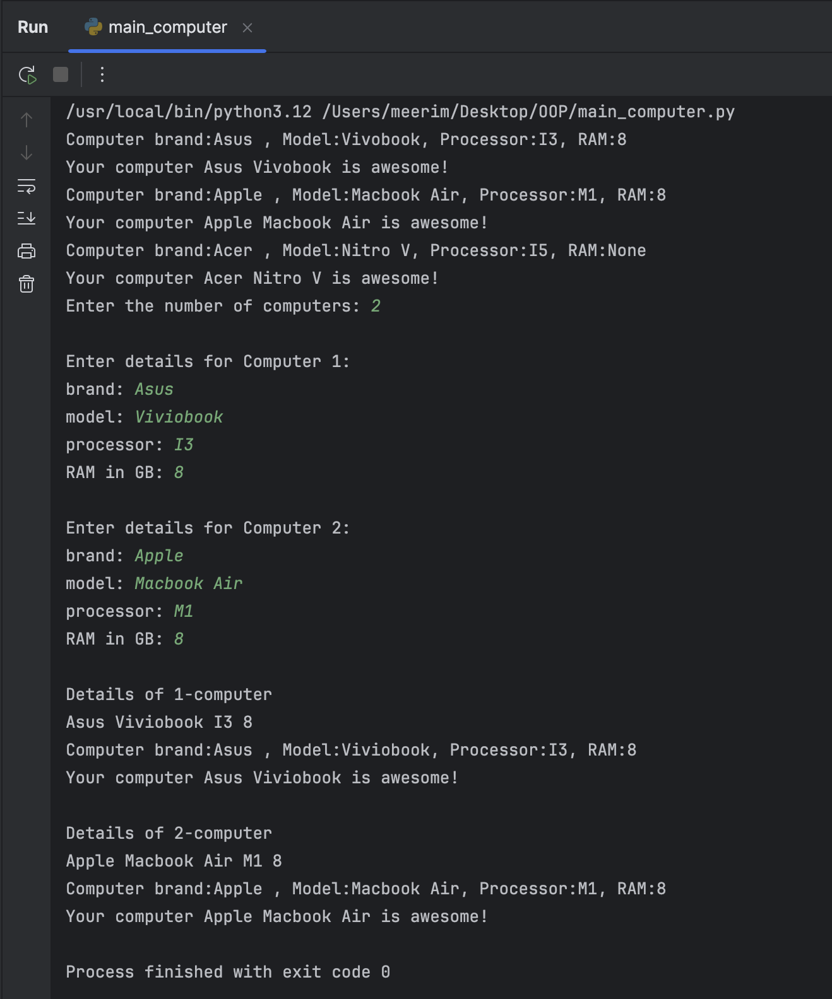

# Computer Class 

The `Computer` class represents a computer with essential attributes and methods. It allows users to store computer details, display them, and perform a simple action.

### Attributes 
- `brand` (str) : The brand of the computer.  
- `model` (str) : The model of the computer.  
- `processor` (str, optional) : The processor type.  
- `RAM` (int, optional) : The amount of RAM in GB.  

### Constructors 
- `Computer(brand, model, processor=None, RAM=None)` → Initializes the computer with given values, allowing optional parameters.  

### Methods
- `display_info()` : Prints the computer’s details in a formatted way.  
- `awesome()` :Displays a message saying the computer is awesome.  

This class provides a simple structure for managing computer details while demonstrating key object-oriented programming concepts like constructors and methods.  

