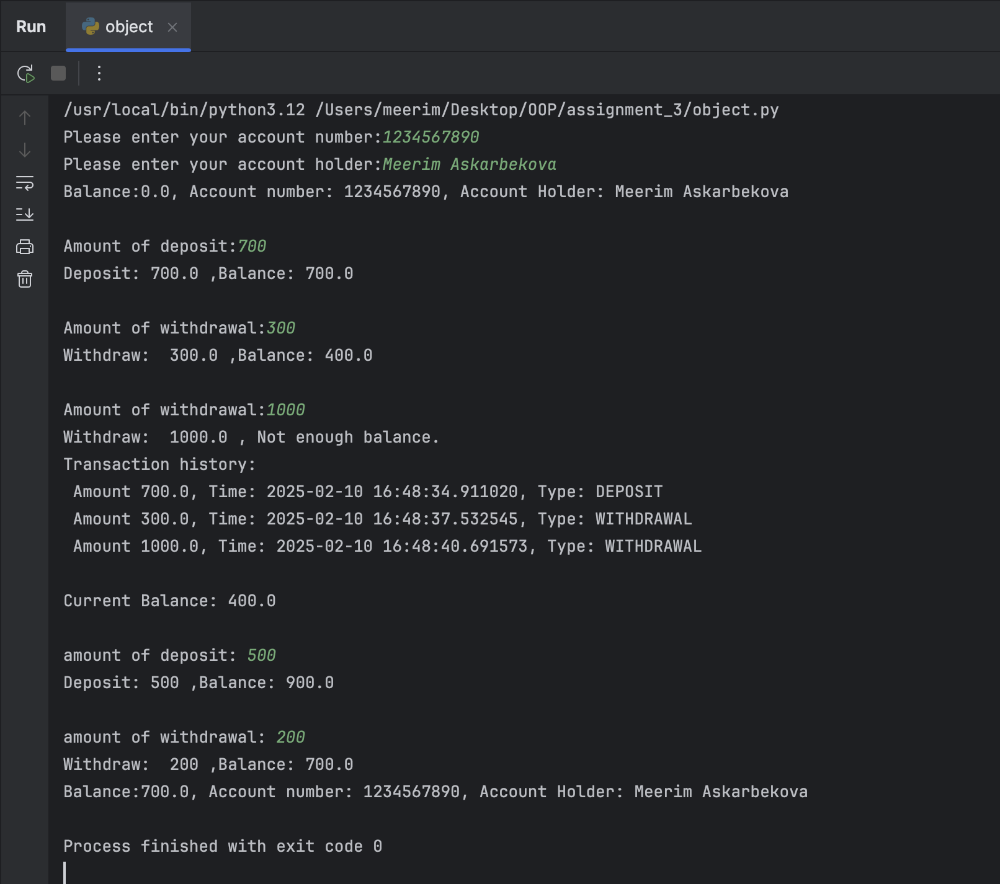
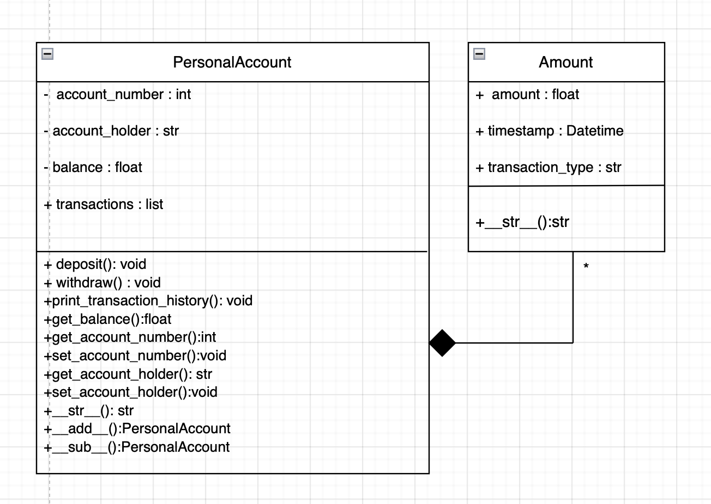

## Personal account management
This project is a Python program for managing personal bank accounts. It allows users to perform deposits, withdrawals, and view transaction history. The program uses object-oriented programming concepts like classes and encapsulation.

### Classes

### 1. Amount

Represents a transaction with details such as amount, timestamp, and type.

Attributes:

- amount: The transaction amount.

- timestamp: The date and time of the transaction.

- transaction_type: The type of transaction ('DEPOSIT' or 'WITHDRAWAL').

Methods:

- __init__: Initializes an Amount object with the transaction amount and type.

- __str__: Returns a string representation of the transaction.

### 2. PersonalAccount

Represents a personal bank account.

Attributes:

- __account_number: The account number.

- __account_holder: The account holder's name.

- __balance: The account balance.

- transactions: A list of Amount objects for transaction history.

Methods:

- __init__: Initializes the account with account number and holder name.

- deposit: Adds money to the account and updates the balance.

- withdraw: Removes money from the account if there is enough balance.

- print_transaction_history: Displays the transaction history.

- get_balance: Returns the current balance.

- get_account_number: Returns the account number.

- set_account_number: Updates the account number.

- get_account_holder: Returns the account holder's name.

- set_account_holder: Updates the account holder's name.

- __str__: Returns a string representation of the account.

- __add__: Adds money to the account using the + operator.

- __sub__: Removes money from the account using the - operator.

