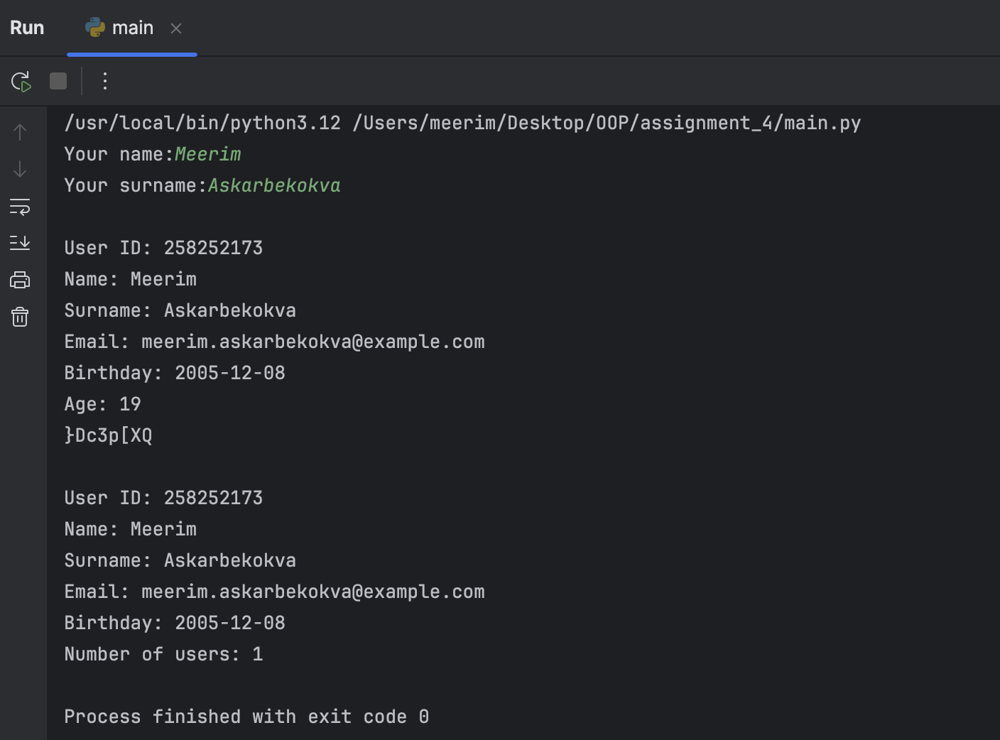

### User Class Methods

This project implements a simple user management system with three main components:

**User Class:** Represents a user with attributes like name, surname, email, password, and birthday.

**UserService Class:** Manages users by adding, finding, updating, and deleting user records.

**UserUtil Class:** Provides utility functions such as generating user IDs, emails, and passwords.

Class Descriptions

User Class

Attributes:

user_id (int): Unique identifier for the user.

name (str): First name of the user.

surname (str): Last name of the user.

email (str): Email of the user.

password (str): Password of the user.

birthday (datetime): Birthday of the user.

Methods:

get_details() -> str: Returns a formatted string containing user details.

get_age() -> int: Computes and returns the user’s age.

UserService Class

Class Attributes:

users (dict): Stores user objects with user_id as the key.

Methods:

add_user(user): Adds a user object to the dictionary.

find_user(user_id) -> User: Finds and returns a user by user_id.

delete_user(user_id): Deletes a user by user_id.

update_user(user_id, user_update): Updates user attributes.

get_number() -> int: Returns the total number of users.

UserUtil Class

Static Methods:

generate_user_id() -> int: Generates a unique user ID (9 digits, starting with the last two digits of the year).

generate_password() -> str: Generates a strong password (at least 8 characters, including uppercase, lowercase, number, and special character).

is_strong_password(password) -> bool: Checks if a password meets strength requirements.

generate_email(name, surname, domain='example.com') -> str: Generates an email using the user’s name and surname.

validate_email(email) -> bool: Validates if an email follows the pattern name.surname@domain.com.

